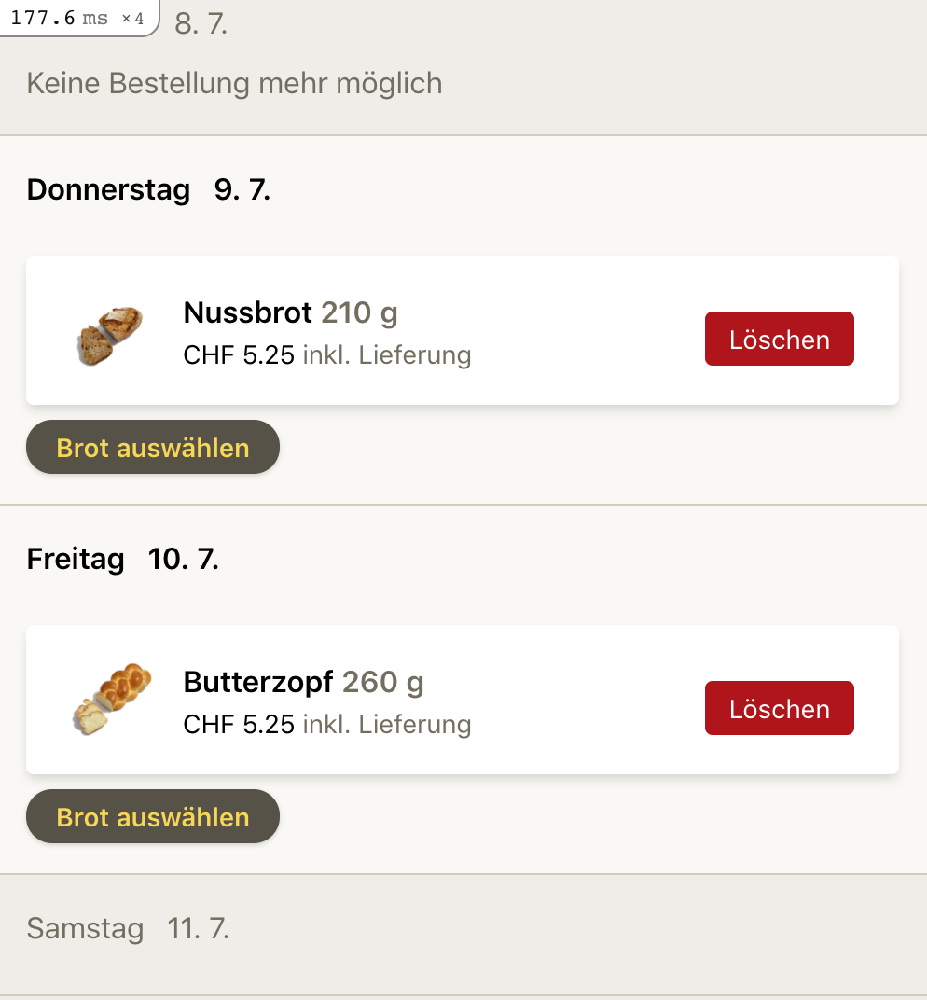

# Have lightning fast reactive actions with Stimulus Reflex partial updates.

[Stimulus reflex](https://docs.stimulusreflex.com/) is an awesome way to build reactive single-page-like applications with Ruby on Rails.
I love the simplicity of it, it let's me do alomst everything in my favorite expressive languange Ruby.

An with the newest update it will introduce partial page updates, that don't go through the controller action anymore, and it will make reflexes lightning fast.

## So how does a reflex action work (simplified)?

* You **trigger a reflex** on the client (by data attribute, or in a stimulus method).
* Your **server side `Reflex` is executed**, where ou can trigger Jobs, set instance variables, do db-stuff
* Then the **original controller action is executed**, but with the newly set instance variables and of course db updates you did in the reflex
* The page on the **client is updated** with morphdom over a websocket connection.

So this gives us a lot of convenience as we reuse all the logic of the original controller aciton that rendered a page initially.
However this advantage also means, that the time to execute the controllr action will delay the client side page update.

## Introducing `morph :selector`

The next release will introduce [different morph modes](https://github.com/hopsoft/stimulus_reflex/pull/211)
that allow you to skip the controller action and instead render a partial, a view_component or a string, that you then morph into the page.

## Let us look at an example:

In my application I have a timeline with 21 days where I can add orders to those days. Executing the controller action and rendering takes around 180ms,
which is not horrible, but definitely not great.



To delete an item in the timeline we can have a simple reflex:

`timeline_reflex.rb`
```ruby
def delete
  ScheduledOrder.destroy(element.dataset[:order_id])
end
```
which is triggered from a button with a simple button with the right data attributes

```erb
<button data-reflex="click->My::TimelineReflex#delete" data-scheduled-order-id="<%= order.id %>">
```

So simple, so slim, so convenient.

But every delete reflex action, will include those 180ms to execute the controller action, meh.

## Speeding up with with partial morph.

Now we can leverage only doing a partial update.

`timeline_reflex.rb`
```ruby
def delete
  # we delete
  ScheduledOrder.destroy(element.dataset[:order_id])
  
  # we get all the data we need to render the component
  @date = element.dataset[:date]
  @pauses = current_user.pauses
  @scheduled_orders = current_user.scheduled_orders.where(date: @date)
  
  # we call morph with a selector and pass the rendered component into it.
  morph "##{day_dom_id}", ApplicationController.render(My::TimelineDayComponent.new(day: @date, scheduled_orders: @scheduled_orders, pauses: @pauses))
end
```

Now instead of doing all the controller action stuff, and rendering 21 days components. We just render one day component.
So our time to exectute the reflex action goes down from 180ms to about 30ms.
